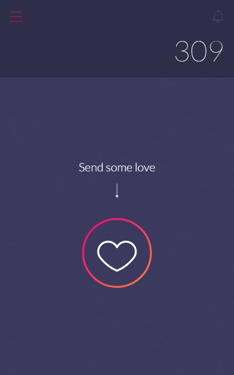

# **Love, love, love** - A Progressive Web App to send some love with Redis

> by  [Made On Mars](https://www.made-on-mars.com)

This is almost the same code as the original repo : [Love Love Love app](https://github.com/MadeOnMars/lovelovelove). But instead of using fs, I'm using a Redis instance. You can easily get free ones on https://redislabs.com for example.



### To install

If you want the Push Notifications to work you will need to create a Google Firebase Project to get you server key and GCM sender id. You can follow the tutorial here : [https://www.made-on-mars.com/blog/how-to-pwa#reengageable](https://www.made-on-mars.com/blog/how-to-pwa-an-introduction-on-progressive-web-app-and-a-tutorial-to-create-one-with-full-features-push-notification-service-worker-offline-mode/#reengageable)

```bash
git clone https://github.com/MadeOnMars/lovelovelove-redis
cd lovelovelove-redis
npm install
npm start
# The project is available at http://localhost:3000
```

### Unleash the power of [Now](https://zeit.co/now)

Because notifications and service workers needs a https server I strongly recommend you to use Now to deploy your prototype.

You just need to so this :

```
npm install -g now
now
```

And your app will be deployed to a https url.
